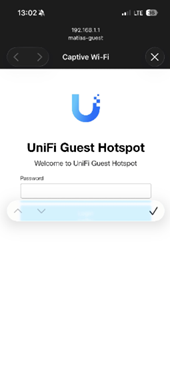
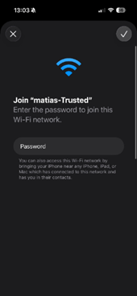
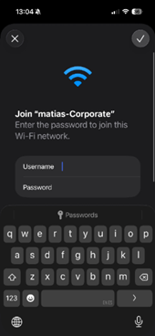

# Building a Secure Wireless Network (UniFi Deployment)

**Author:** Oscar Castro Garrido
**Project:** Activity 6 - Network Security
**Platform:** Ubiquiti UniFi (UCG Ultra & U6 Lite)

## 📋 Project Overview
This project demonstrates the deployment of a secure, segmented wireless network architecture designed to meet specific organizational security requirements. The setup utilizes **VLANs** for traffic isolation, **WPA3** for enhanced encryption, and granular access controls including **blackout schedules** and **bandwidth limiting**.

## 🛠️ Network Topology & Hardware
The network is managed via a UniFi Cloud Gateway Ultra (UCG Ultra) acting as the router and controller, connected to a U6 Lite Access Point.

* **Gateway:** UCG Ultra
* **Access Point:** U6 Lite
* **Clients:** Workstations (Laptops), Mobile Devices (iOS)

## 📡 VLAN Configuration & Segmentation
To ensure security and traffic isolation, the network was divided into four distinct Virtual Local Area Networks (VLANs):

| Network Name | VLAN ID | Subnet | Purpose |
|-------------|--------:|--------|---------|
| **Default** | 1 | `192.168.1.0/24` | Management & Infrastructure |
| **Matias-Corporate** | 10 | `192.168.2.0/24` | Employee / Internal Use |
| **Matias-Trusted** | 20 | `192.168.3.0/24` | Known Devices (IoT / Personal) |
| **Matias-Guest** | 30 | `192.168.4.0/24` | Guest Access (Isolated) |

## 🔐 Security Features Implemented

### 1. Access Control & Authentication
* **Corporate Network:** Configured with **WPA Enterprise** using username and password authentication.
* **Trusted Network:** Uses **WPA2/WPA3 Personal** encryption.
* **Guest Network:** Uses a **Captive Portal** with voucher-based authentication.

### 2. Guest Policies (Hotspot)
* **Vouchers:** Single-use vouchers with a 1-day expiration.
* **Bandwidth Limiting:** Applied to guest users to avoid congestion.
* **Isolation:** Guest traffic is isolated from corporate and management networks.

### 3. WiFi Blackout Scheduler
To reduce the attack surface during non-operational hours, a blackout schedule was implemented:

* **Active Days:** Monday – Friday
* **WiFi Disabled:** 5:00 PM – 8:00 AM (next day)

## ✅ Verification and Testing

### Connectivity Validation
The following devices were successfully authenticated and assigned IP addresses from their respective DHCP pools:

* **Corporate User:** Authenticated via WPA Enterprise on iOS (VLAN 10).
* **Guest User:** Redirected to the UniFi Guest Hotspot and authenticated using a voucher (VLAN 30).
* **Trusted Device:** Connected directly to VLAN 20 (`192.168.3.201`).

  

## 🚀 Conclusion
This deployment demonstrates enterprise-grade wireless security using UniFi. VLAN segmentation prevents lateral movement, while WPA Enterprise, captive portal controls, and scheduled WiFi availability ensure secure and policy-compliant network access.
